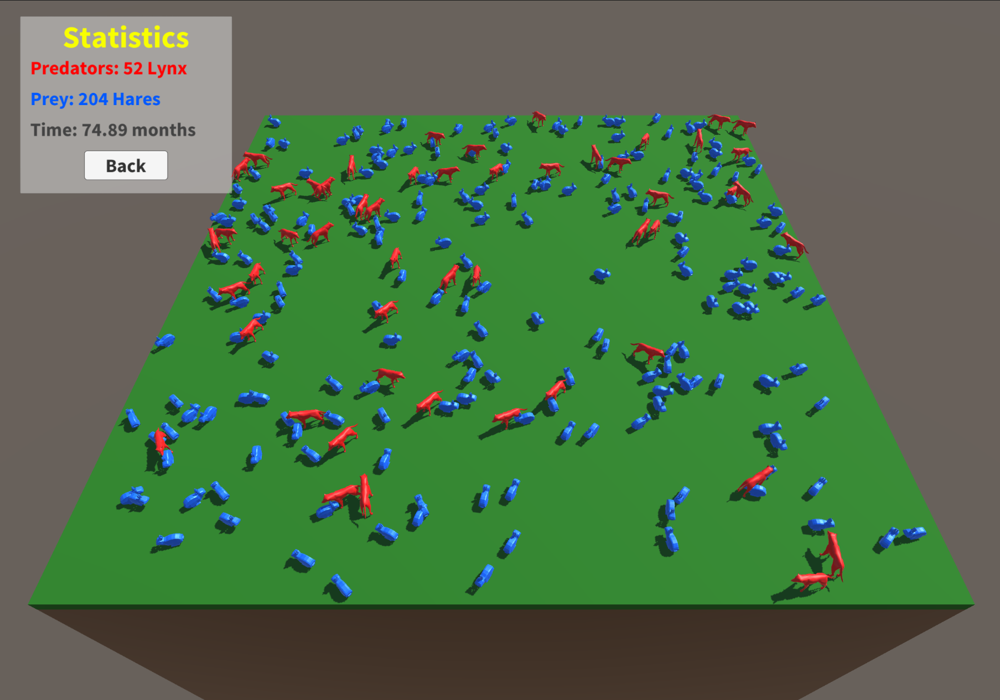
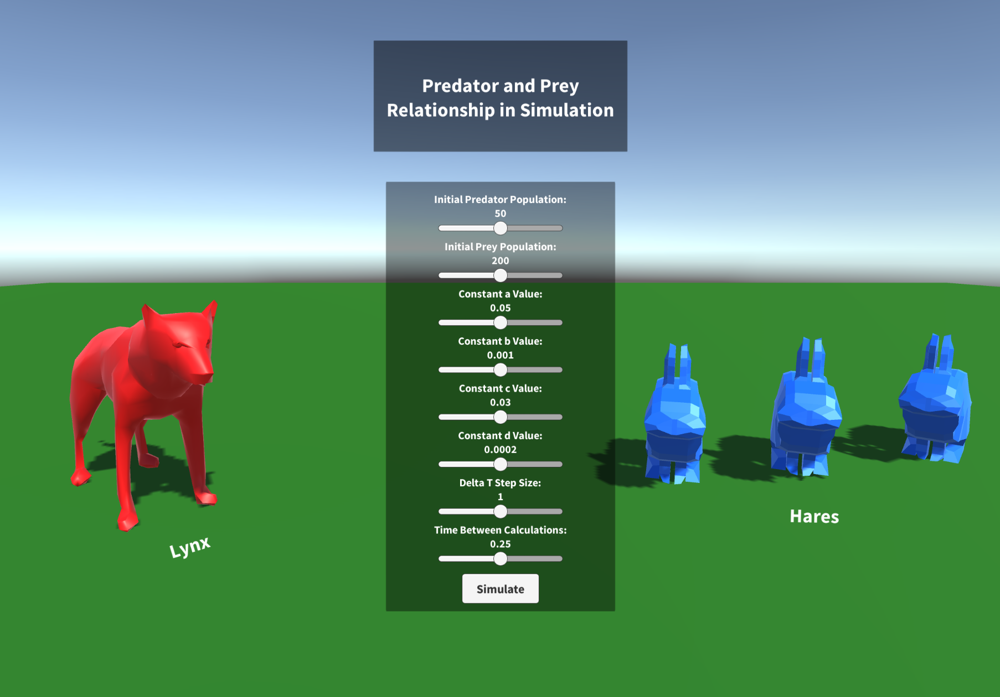

# Lotka Volterra Simulation

## Summary
The **Lotka Volterra Simulation** is a Unity project that models the relationship between predator and prey populations through a visual simulation. This was the final project for my AP Calculus AB class. The predators are represented as red lynx roaming in a square environment, and the prey are blue hares. As the populations of both species fluctuate, the changes can be visually seen in the environment, providing context to how the population dynamics work between the species.

## Simulation
The simulation depicts a certain amount of red lynx and blue hares roaming around a 3D environment. The number of lynx and hares will fluctuate according to the ***Lotka-Volterra model***. That is, when there are relatively more lynx, the hare population will decrease. Conversely, when there are relatively more hares, the lynx population will increase, and vice versa. There is no physical interaction between the species in the simulation, but it is easy to visualize how one population changes as a function of the other.



## Lotka-Volterra Model

The ***Lotka-Volterra model*** is a pair of first-order nonlinear differential equations that represent the rate of change of predator and prey populations. They are expressed by this code:

```bash
h = h + dt*((a * h) - (b * h * l));
l = l + dt*((d * h1 * l) - (c * l));
```
The parameters a, b, c, and d all correspond to either the birth/death rates of the predator or prey populations. These parameters, as well as others like dt and the initial population size, can be altered in the main menu to change the results of the simulation:



## Final Project Presentation

### Slideshow
If you would like to view the final project presentation slideshow that accompanied this simulation, you can here: https://docs.google.com/presentation/d/1OnAPxLG5ttYtdaq9VnDO2r43t1mf_CRvUc7V-fqqX2k/mobilepresent?slide=id.g1323fe9ee33_0_11

## How to Use

### Running the Application
- Download the zip file for the project
- Open the project in Unity
- To use the .exe file: Unzip the "UnityPlayer.zip" file

### Support
- Issues: If you encounter problems, please open an issue on the GitHub Issues page.
- Contact: For further assistance, you can contact me at dehnertdylan@gmail.com.
